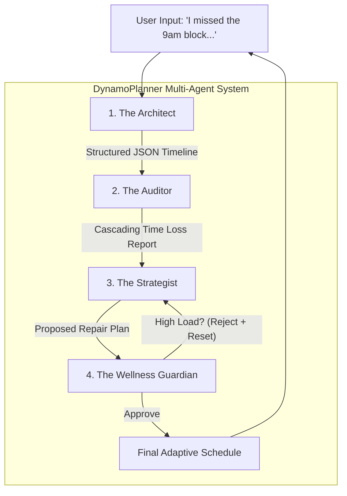

# DynamoPlanner
**A Constraint-Adaptive Multi-Agent System for Dynamic Scheduling**


> **"Rescheduling is a negotiation, not a calculation."**

DynamoPlanner is an intelligent scheduling assistant built with the **Google Agent Development Kit (ADK)** and **Gemini 2.5 Flash Lite**. Unlike static calendar tools that break when life happens, DynamoPlanner uses a multi-agent architecture to reason about trade-offs, prioritize mental wellness, and adapt schedules in real-time to prevent user burnout.

---

## Table of Contents
- [Problem Statement](#-problem-statement)
- [Why Agents?](#-why-agents)
- [Architecture & Workflow](#-architecture--workflow)
- [Agent Roles](#-agent-roles)
- [Technical Implementation](#-technical-implementation)
- [Setup & Installation](#-setup--installation)
- [Demo Scenarios](#-demo-scenarios)
- [Deployment](#-deployment)
- [Future Improvements](#-future-improvements)

---

## 🚨 Problem Statement
In today's fast-paced world, productivity tools are rigid, but human lives are dynamic. We plan for a "perfect day," but when life happens—oversleeping, unexpected errands, or running out of energy—the schedule breaks.

For students and professionals, specifically those prone to anxiety or burnout, a missed task often triggers a **"shame spiral."**
* **High Cognitive Load:** The effort required to manually calculate how to reshuffle the rest of the day is so high that users often abandon the plan entirely.
* **Static Failure:** Current tools simply notify you that you are late, offering no assistance in fixing the cascading delays. This leads to a cycle of guilt, task paralysis, and lost productivity.

## 🤖 Why Agents?
Standard algorithmic code follows rigid `If/else` rules. If a user misses a task, a standard app simply marks it "Overdue" without context. This doesn't solve the human problem.

**Agents are the right solution because rescheduling is a negotiation.**
To fix a broken day, the system needs to reason about trade-offs and nuance. For example: *"Is it better to skip the gym to save the internship prep? Or should I shorten lunch because I'm not that hungry?"*

Only an LLM-powered agent can understand the semantic priority of "Career Prep" versus "Casual Reading." An agent can act as a **compassionate partner** that adapts to reality rather than a rigid taskmaster demanding perfection.

---

## 🏗️ Architecture & Workflow
I built DynamoPlanner as a constraint-adaptive multi-agent system orchestrated using the **Google Agent Development Kit (ADK)**.

The architecture utilizes a **Sequential Workflow** of four specialized agents, passing the "Session State" (the living schedule) down the chain.



## 🕵️ Agent Roles

### 1. The Architect (Parser) 📝
* **Role:** Logic & Parsing.
* **Function:** Parses natural language goals into a structured JSON timeline using custom constraint-solving tools.

### 2. The Auditor (State Monitor) 🔍
* **Role:** Reality Check.
* **Function:** Monitors the session state. It compares the plan vs. reality (e.g., "User reported missing the 9 AM block") and calculates the **"Cascading Time Loss."**

### 3. The Strategist (Reasoning Engine) 🧠
* **Role:** Core Intelligence.
* **Function:** Receives the conflict report and formulates a repair plan. It applies **"Triage Logic"**—dropping Low Priority tasks to save High Priority ones.

### 4. The Wellness Guardian (Agents for Good Core) 🛡️
* **Role:** Safety Valve.
* **Function:** A safety check that reviews every plan. If the Strategist proposes 4+ hours of continuous cognitive load to "catch up," the Guardian rejects it and forcibly inserts a **"15-minute Mental Reset."**

---

## 🛠 Technical Implementation
DynamoPlanner integrates key course concepts using **Google ADK (Python)**:

* **Model:** `Gemini 2.5 Flash Lite` (Chosen for speed and cost-efficiency, crucial for real-time consumer apps).
* **Custom Tools:** Deterministic Python functions (`generate_draft_schedule`, `calculate_time_impact`) handle specific time calculations, solving the "hallucination" problem common in LLM scheduling.
* **Observability:** Implemented the ADK `LoggingPlugin` to trace the chain-of-thought between agents, ensuring that the "Wellness Guardian" correctly intervenes when schedules become unhealthy.
* **Deployment:** Packaged using the **Agent2Agent (A2A) Protocol** and deployed on **Vertex AI Agent Engine**. This turns the agent into a scalable microservice.

---

## ⚙️ Setup & Installation

### Prerequisites
* Python 3.10+
* Google Cloud Project with Vertex AI API enabled.

### Installation Steps

1.  **Clone the Repository**
    ```bash
    git clone [https://github.com/your-username/DynamoPlanner.git](https://github.com/your-username/DynamoPlanner.git)
    cd DynamoPlanner
    ```

2.  **Install Requirements**
    ```bash
    pip install -r requirements.txt
    ```

3.  **Configure Environment**
    Create a `.env` file with your credentials:
    ```bash
    GOOGLE_GEMINI_API="your-api-key-here"
    PROJECT_ID="your-project-id"
    LOCATION="us-west1"
    ```

4.  **Run the Notebook**
    Open `DynamoPlanner_Demo.ipynb` to see the agents in action.

---

## 🧪 Demo Scenarios
In the submitted notebook, we demonstrate the full lifecycle:

1.  **Planning:** The user requests a heavy study day. The *Architect* builds a valid schedule.
2.  **Disruption:** The user says, *"I overslept and missed Math."*
3.  **Recovery:** * The *Auditor* detects the loss. 
    * The *Strategist* drops the "Gym" session to save "Interview Prep." 
    * The *Wellness Guardian* approves the new plan but inserts a breathing break to manage the user's stress.

---

## 🚀 Deployment
The agent is successfully deployed on the Vertex AI Agent Engine and can be invoked via the SDK.

**Agent Resource ID:**
```text
projects/74874973778/locations/us-west1/reasoningEngines/7079816943900819456
```

---

## 🔮 Future Improvements
If I had more time, I would:
* **Google Calendar API:** Replace the mock database tools with the Google Calendar API to modify real-world events.
* **Memory Bank:** Implement Vertex AI Memory Bank to learn user energy patterns over weeks (e.g., *"You always miss 8 AM meetings, so I will stop scheduling them"*).

---

..
